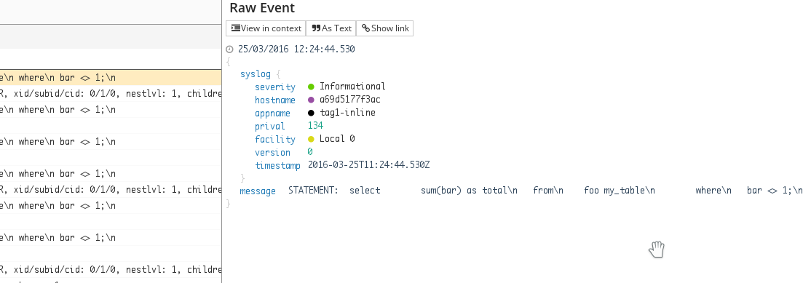
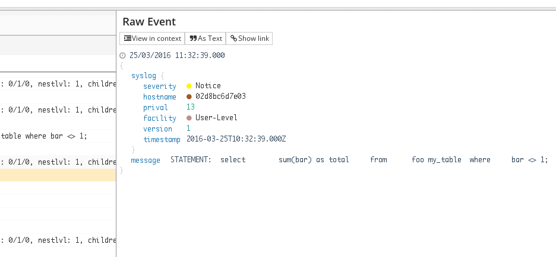

# Multi-line support

## What will try to do?
In this post, I'm going to show how handle multi lines with the common log shippers:
* rsyslog,
* syslog-ng
* fluentd
* logstash
* nxlo (soon)


I will illustrated each shippers with two common examples: Java error stacks (soon) and PostgreSQL log events.
Java and Postgres are quite good produces multi-line logs, for SQL queries, or for THE NullPointerException.
Parsing multi-line to collect them into a single event can be rapidly a nightmare.

So, don't panic and take a seat. Debugging and monitoring should be more pleasant soon.

Before start, let's talk about some prerequisites and context if you want to reproduce examples.
1. All logs are written into a file. I mainly use a `tail-like` command.
2. All logs are stream to a single pipe: in others terms, I assume that all lines for an event
are contiguous. In this post, I won't show you how to do when multiple events are cross.
3. We don't focus to the event output.


### Input events (PostgreSQL/Java)
In order to reproduce examples, you have to configure the log section in PostgreSQL. Edit
`$PG_DATA/postgresql.conf` and add/replace the following section:
```properties

# In order to convert multi-line to a single message, you need to bypass syslog handler
log_destination = 'stderr'

# Collect the stderr in write logs into a file
logging_collector = on

# For this tutorial, all lines are written to a single file
# Rolling files are still recommended in production environment
log_filename = 'postgresql.log'


# Tell Postgres to be more verbose. Adapt it for your needs
client_min_messages = debug3
log_min_messages = debug3
log_min_error_statement = debug3
log_min_duration_statement = 0

# Customize log prefix
log_line_prefix = '%t postgres[%p]: '
```

Then restart your postgres server.

## Parse PostgreSQL multi-lines
Before start, let's see how logs look like, `tail $PG_DATA/pg_log/postgresql.log`.

```sql
select 
  sum(bar) as total
from
  foo my_table
where
  bar <> 1;

```


```
2016-03-21 11:22:09 UTC postgres[423]: DEBUG:  name: unnamed; blockState:       STARTED; state: INPROGR, xid/subid/cid: 0/1/0, nestlvl: 1, children:
2016-03-21 11:22:10 UTC postgres[423]: DEBUG:  StartTransactionCommand
2016-03-21 11:22:10 UTC postgres[423]: STATEMENT:  select 
            sum(bar) as total
        from
            foo my_table
        where
            bar <> 1;
2016-03-21 11:22:10 UTC postgres[423]: DEBUG:  StartTransaction
...
```


### RSyslog (since v8.10.0)
Multi-line support is recent and required at minium the 8.10.0 rsyslog version.
Before start, check the version with `rsyslogd -v`.

Multu-line support is only available on `imfile` module. So, your logs need to be write
in a specific file before be parsed and sent to syslog daemon. Send logs to a facility (local0 for instance),
won't work.

In order to enable multi-line, you need to use the inline syntax. There is no directives. 


```properties
module(load="imfile" PollingInterval="10") #needs to be done just once

# File 1
input(type="imfile"
  File="/app/log"
  Tag="tag1-inline"
  Severity="info"
  startmsg.regex="^((STATEMENT)|(LOG)|(DEBUG)|(FATAL)|(ERROR)|(WARNING)|([A-Z]+)): "
)
```

Here, the output events received by Logmatic.io.



Note that the newlines have been replace by `\\n`.

```json
{
  "syslog": {
    "severity": 6,
    "hostname": "a69d5177f3ac",
    "appname": "tag1-inline",
    "prival": 134,
    "facility": 16,
    "version": 0,
    "timestamp": "2016-03-25T11:24:44.530Z"
  },
  "message": "STATEMENT:  select\t  sum(bar) as total\\n\tfrom\\n\t  foo my_table\\n\twhere\\n\t  bar <> 1;\\n"
}

```

### Syslog-ng

Syslog-ng works similar to rsyslog.
You can choose between 2 multiline modes, the `prefix-garbage` and the `prefix-suffix`.

`prefix-garbage` acts similary to rsyslog behavior, you define a prefix line-breaker. When this prefix is reach
syslog-ng starts a new event until it finds a new prefix line-breaker. `prefix-suffix` uses a suffix to detect the event end.
All events not encapsulated by the prefix/suffix are simply ignored.


Read the [documentation](https://www.balabit.com/sites/default/files/documents/syslog-ng-ose-latest-guides/en/syslog-ng-ose-guide-admin/html/reference-source-file.html) for more details. 

I'm going to show you how to configure the `prefix-garbage` mode.


```properties
# define your own template (Logmatic.io here)
template LogmaticFormat { 
  template("YOUR_API_KEY <${PRI}>1 ${ISODATE} ${HOST:--} ${PROGRAM:--} ${PID:--} ${MSGID:--} ${SDATA:--} ${MSG}\n");
};


# define a tcp output (to Logmatic.io here)
destination d_logmatic { 
  network(
    "api.logmatic.io"
    port(10514)
    template(LogmaticFormat)
    flags(no-multi-line) # force syslog-ng to send without \n char. Here newlines are replace with spaces.
  ;
};

source s_files {
  file(
        "/app/log"
         flags(no-parse)
         multi-line-mode(prefix-garbage)
         multi-line-prefix("^((STATEMENT)|(LOG)|(DEBUG)|(FATAL)|(ERROR)|(WARNING)|([A-Z]+)):")
  );
};

```

Here, the output events received by Logmatic.io.


Note that the newlines have been replace by spaces.

```json
{
  "syslog": {
    "severity": 5,
    "hostname": "02d8bc6d7e03",
    "prival": 13,
    "facility": 1,
    "version": 1,
    "timestamp": "2016-03-25T10:32:39.000Z"
  },
  "message": "STATEMENT:  select \t  sum(bar) as total \tfrom \t  foo my_table \twhere \t  bar <> 1;"
}

```


### Fluentd

The `in_tail` plugin allows to parse multi-lines. You have to set up `multiline` format in order to
enable the multi-line parsing.

The syntax is quite simple. You have to define a patter for the split lines. Regex are ruby-compatible.
In our example, you still break lines on "SEVERITY:". Next lines start with spaces or tabs.


Fluentd allows to add format1 trough format20 in order to parse different line format. Here, the plugin
use the grok format. See the [documentation](http://) for more details.

On the above input, this configuration

```xml
<source>
  @type tail
  path  /var/lib/postgresql/data/pg_log/postgresql.log
  pos_file /var/log/td-agent/postgresql.log.pos
  tag postgres
  format multiline
  format_firstline /^((STATEMENT)|(LOG)|(DEBUG)|(FATAL)|(ERROR)|(WARNING)|([A-Z]+)):/
  format1 /^(?<severity>((STATEMENT)|(LOG)|(DEBUG)|(FATAL)|(ERROR)|(WARNING)|([A-Z]+))): (?<message>.*)$/
  time_format %b %d %H:%M:%S
</source>
```

Will produce these events

```json

```
### Logstash

The previous versions of Logstash could handle multiines and multistreams support. *In fact, the [multiline filter](https://www.elastic.co/guide/en/logstash/current/plugins-filters-multiline.html) is deprecated*.
Logstash can handle mulitline only with the [multiline codec](https://www.elastic.co/guide/en/logstash/current/plugins-codecs-multiline.html). 

The multiline codec can be apply to a file or an input. Its behavior is similar to rsyslog, fluentd, and so on.

The syntax and the line-breake rule differ a bit. The configure logstash to agregate all lines that don't start (`negate => true`) with
the pattern (`pattern => ...`) are merged to the previous line (`what => previous`).


```json

input {
  file {
    "path" => "/path/to/pg_log/postgres.log"
    "sincedb_path" => "/path/to/pg_log/sincedb_pgsql"
    
    # fix up multiple lines in log output into one entry    
     codec => multiline {
       pattern => "(?<severity>((STATEMENT)|(LOG)|(DEBUG)|(FATAL)|(ERROR)|(WARNING)|([A-Z]+))): "
       what => previous
       negate => true
     }
  }
}

filter {
  # your filters and enrichments ...
}

output {
  # your output to Logmatic.io :) 
}
```

